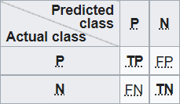
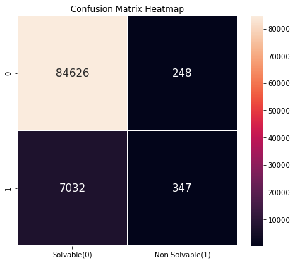
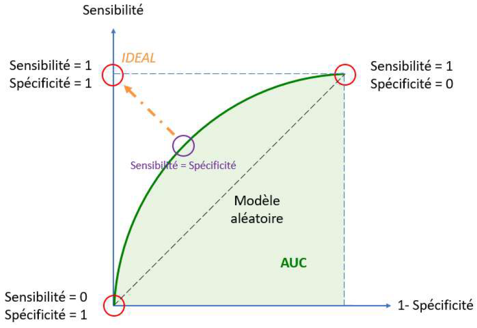
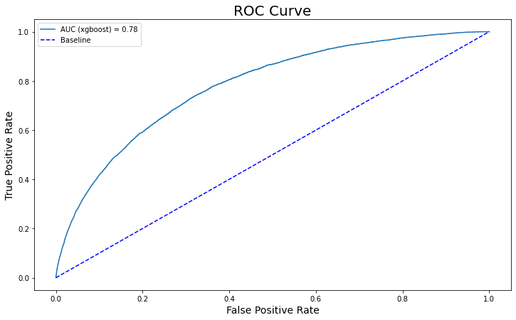
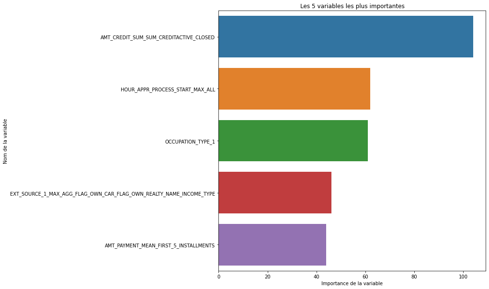
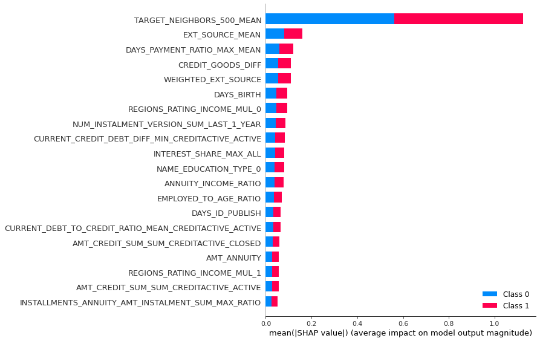
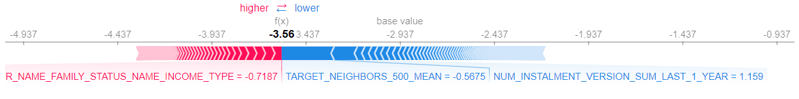

# Projet7
Projet7 de la formation DataScientist d'Openclassroom

Projet
Implémentez un modèle de scoring.

Il faudra ici implémenter un modèle d’apprentissage supervisé de “scoring crédit” pour calculer la probabilité qu’un client rembourse ou non son crédit, puis classifie la demande en crédit accordé ou refusé. 

Objectifs

- Construire un modèle de scoring qui donnera une prédiction sur la probabilité de faillite d'un client de façon automatique.

- Construire un dashboard interactif à destination des gestionnaires de la relation client permettant d'interpréter les prédictions faites par le modèle et d’améliorer la connaissance client des chargés de relation client.

Données

Nous aurons à notre disposition plusieurs datasets, qui nous donnerons différentes informations sur les clients, notamment ses crédits en cours mais également des informations qui lui seront propre comme le nombre d’enfant du client, s’il est en couple ou non, etc.
Mais il y aura des informations concernant les crédits précèdent et le fait de savoir s’ils ont été remboursé ou non. Ce jeu de données sera utilisé pour l’apprentissage automatique, pour ça nous partirons du dataset application_train auquel nous fusionnerons les autres datasets a notre disposition.

Un autre dataset qui ne contient pas d'étiquette nommé application_test, concerne les crédits en cours pour lesquels il faut prédire s’ils seront à priori rembourser ou non.

Modélisation

Après avoir travaillé à la fusion des différents datasets et à la création de nouvelles variables nous passerons à la modélisation. Ici le but sera d’entraîner différents modèles afin de prédire au mieux la capacité de remboursement des clients.
Nous utiliserons 3 modèles basés sur les arbres de décision qui seront Random Forest, XGBoost et LightGBM.
Nous avons pu voir dans un projet précèdent que les modèles basés sur les arbres de décision donnent de meilleurs résultats de manière générale.

Nos modèles seront entraînés avec un dataset de taille (307507, 1097) qui passera a (307507, 941) après avoir supprimer les variables contenant trop de valeurs manquantes (taux de valeurs manquantes > 60%).
Après ce nettoyage rapide, nous remplacerons les valeurs manquantes, en utilisant la médiane ou la moyenne en fonction des boxplots des variables, si la variable possède des outliers nous utiliserons la médiane qui sera moins sensible à ces derniers et si il n’y en a pas nous utiliserons la moyenne.
Et enfin nous diviserons ce dataset en 4 jeu de données X_train, X_test, y_train et y_test. 

Comme expliqué avant, le dataset application_train à une variable TARGET, elle sera utilisée pour l’entraînement, elle prendra la valeur 0 ou 1.
Un client a la valeur 1 s’il a des difficulté de paiement et 0 dans les autres cas, il ne faudra donc pas donner de crédit aux personnes prédite 1, notamment si c’est un faux négative.
Dire qu’un client est un faux négatif signifie que l’on va lui accorder un crédit qu’il ne pourra pas rembourser.

Pour évaluer le problème nous allons donc comparer les valeurs réelles à notre disposition avec les valeurs prédites que nous obtiendrons après avoir entraîné nos différents modèles.

Pour nous aider nous pouvons tracer une matrice de confusion qui nous aidera à nous y retrouver, par exemple nous pourrons avoir cette matrice (j’ai utilisé la matrice qui suit, je considère positive les classes 0, les crédits qui seront remboursés et 1 ceux qui ne le seront pas) :

Pour notre projet nous pourrons donc avoir des matrices de ce genre, exemple de la matrice de confusion avec le modèle XGBoost:

Pour comparé les modèles nous utiliserons le score AUC, ce score renvoie à l’aire sous la courbe ROC qui représente généralement un taux de vrais positifs sur l’axe Y et un taux de faux positifs sur l’axe X.
Cela signifie que le coin supérieur gauche du graphique est le point «idéal»: un taux de faux positifs de 0 et un taux de vrais positifs de 1. Ce n'est pas très réaliste, mais cela signifie qu'une plus grande zone sous la courbe (AUC) est généralement meilleure. 

Exemple de courbe ROC et du score AUC avec le modèle XGBoost :

Le modèle qui va se démarquer est le modèle LightGBM, qui aura les meilleurs valeurs (pour les différentes métriques) de manière générale.

Optimisation métier

En procédant comme nous avons pu le faire avant, nous ne tenons pas compte de la réalité métier ou il faut éviter au maximum les faux négatifs comme expliquer plus haut, car comme on a pu voir, car donner un crédit à une personne qui ne pourra pas le rembourser (FN : Faux négatif) va coûter cher à l’organisme qui va l’attribuer, encore plus que de refuser un crédit alors que le client peut le rembourser (FP : Faux positif). Il
 va donc falloir trouver le bon compromis entre les 2.

Pour tenir compte de ça nous allons mettre en place une fonction qui calculera un coût métier qu’on cherchera à réduire.
Pour ça nous attribuerons un coût de 10 à un FN et un coût de 1 à un FP. 
En reprenant la matrice de confusion ci-dessus nous aurons un coût métier de 7032*10 + 248 = 70 568.
Pour réduire ce coût au maximum nous utiliserons un seuil de classification, qui modifiera la valeur (que l’on obtiendra avec predict_proba) à notre disposition à 1 à partir de ce seuil.

Lorsque l’on aura trouver ce seuil, nous entraînerons une nouvelle fois notre modèle avec différents paramètres via HyperOpt qui peut également permettre une certaine optimisation des modèles.

Interprétabilité globale et locale du modèle

Les différents modèles utilisés possèdent des méthodes permettant de connaître les variables les plus importantes, c’est à dire celles qui vont avoir le plus d’influence sur la classification des différents profils de clients. Les variables qui auront le score le plus élevé seront celles participant le plus.

Il y a 2 approches à l’interprétabilité, celle dite globale et celle dite locale. La globale nous renseignera qu’elles sont globalement les meilleures variables, alors que la locale va nous renseigner sur les causes des évènement particulier que l’on pourrait voir, par exemple ce qui fait qu’un client aura tendance à être jugé positif ou non pour un prêt d’argent.

Exemple explication globale et locale des variables :

Pour l’approche globale nous utiliserons méthode du modèle LGBMClassifier qui est feature_importances_:

Pour l’approche locale nous utiliserons SHAP, nous pouvons également l’utiliser pour l’interprétabilité globale. 

La valeur de Shap proposée par Lundberg et al. [4] est la valeur SHapley Additive exPlanation. L’idée proposée par ces auteurs est de calculer la valeur de Shapley pour toutes les variables à chaque exemple du dataset. Cette approche explique la sortie d’un modèle par la somme des effets φi de chaque variable Xi. Ils se basent sur la valeur de Shapley qui provient de la théorie des jeux. L’idée est de moyenner l’impact qu’une variable a pour toutes les combinaisons de variables possibles. 

Ils ont démontré que cette approche respectait les trois propriétés suivantes :
    • Additivité : la somme des effets des variables est égale à la prédiction du modèle pour tous les exemples.
    • Variables nulles sans effet : si une variable de l’exemple considéré est à zéro, alors la variable ne doit pas avoir d’impact pour cet exemple.
    • Cohérence : si un modèle change, tel que l’effet d’une variable est plus important sur le modèle, l’attribution assignée à cette variable ne doit pas baisser.

Meilleurs Variables Globales

Meilleurs Variables Locales

En rouge, les variables qui ont un impact positif (contribuent à ce que la prédiction soit plus élevée que la valeur de base, dans notre cas les dossiers remboursés) et, en bleu, celles ayant un impact négatif (contribuent à ce que la prédiction soit plus basse que la valeur de base, dans notre cas les dossiers non remboursés).

 
Améliorations possibles

enrichissment donnée (exemple revenu du conjoint, revenu foyer, avis d’imposition…)

Trop de features qui n’aident pas a l’interprétabilité du modèle

optimisation de la fonction de coût pas d’influence sur matrice de confusion

D’autres approches plus complexes seraient de remonter cette mesure de calcul de coût métier (avec optimisation du seuil) dans la simulation fine du modèle final choisi, voire pour tous les modèles (cette mesure remplacerait l’AUC)
